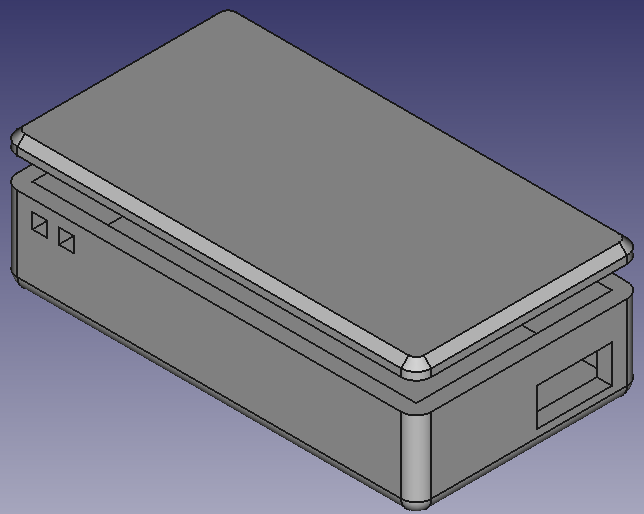
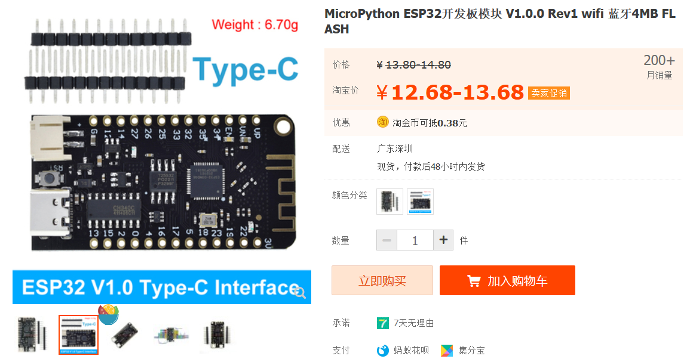

# esp32-case-for-micropython-rev1.0.0

Above is a simple case designed for the following ESP32 board. Note that you need to glue the board on the case. So as the cap. Also, it does not make rooms for all the pins and the battery.

